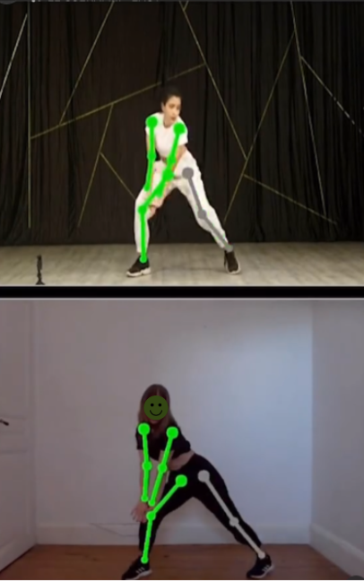

# perfect-move
<br>

**perfect-move** is an application that allows users to load a dance video from YouTube and try to reproduce the dance in front of a camera. Using OpenCV and MediaPipe’s pose estimation (a technique for real-time human pose detection), it analyzes limb movements and shows how accurately each limb matches the original dance.

---

## Features

- Download dance videos directly from YouTube.
- Capture live webcam feed to compare your movements with the video.
- Real-time limb detection and angle comparison using MediaPipe Pose.
- Visual feedback showing accuracy of your movements.
- Easy-to-use web interface powered by Flask.

---

## How It Works

1. The user inputs a YouTube dance video URL.
2. The video is downloaded and played back.
3. The webcam captures the user performing the dance.
4. The app detects key body joints and calculates angles between limbs in both the video and webcam feed.
5. Angles and directions are compared to measure how closely the user’s movements match the original dance.
6. Color-coded visuals show the accuracy for each limb in real time.

---

## Technologies Used

- Python
- Flask (for the web interface)
- OpenCV (computer vision)
- MediaPipe Pose (human pose detection)
- Pytube (YouTube video downloading)
- NumPy (numerical operations)

---

## Installation

1. Clone the repository:
   ```bash
   git clone https://github.com/AriSky1/perfect-move.git
   cd perfect-move
   
2. Install dependencies:
pip install -r requirements.txt

3. Run the app:
python app.py